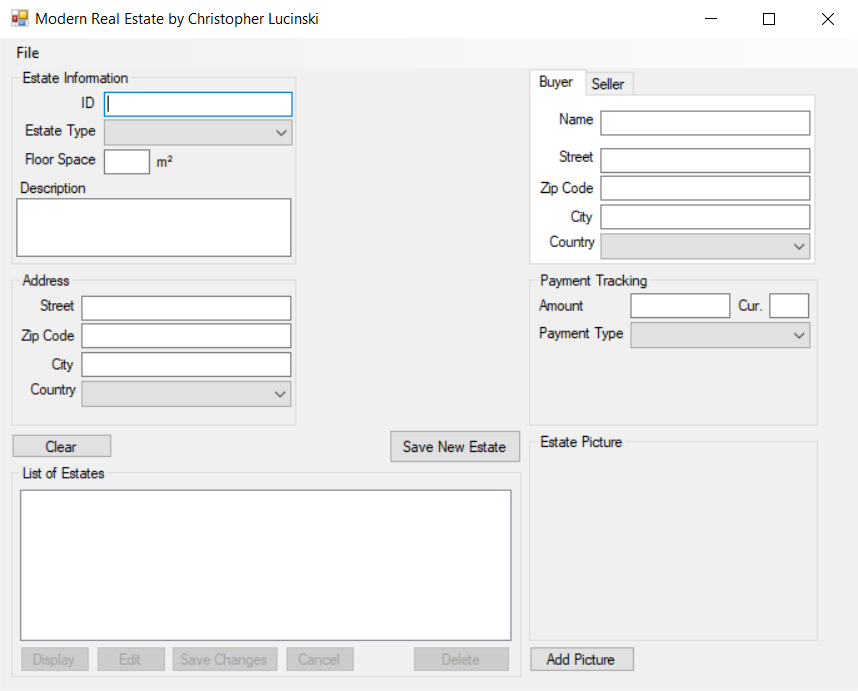
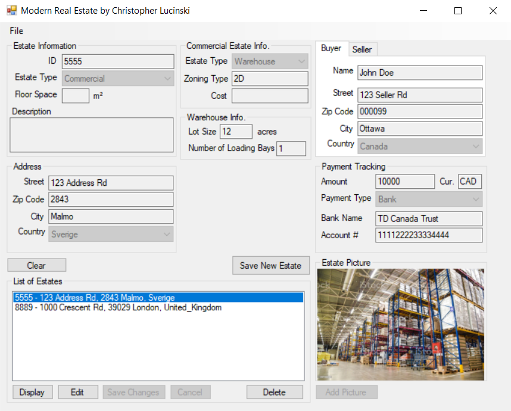
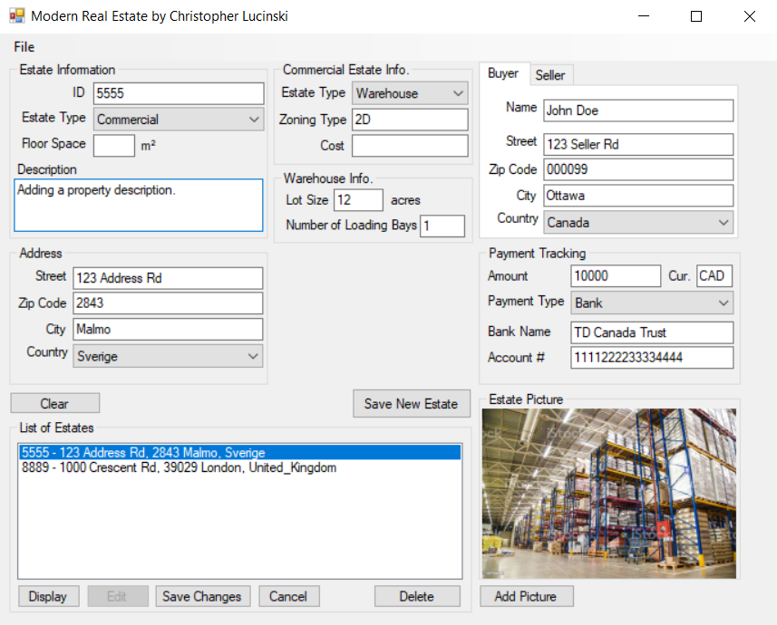
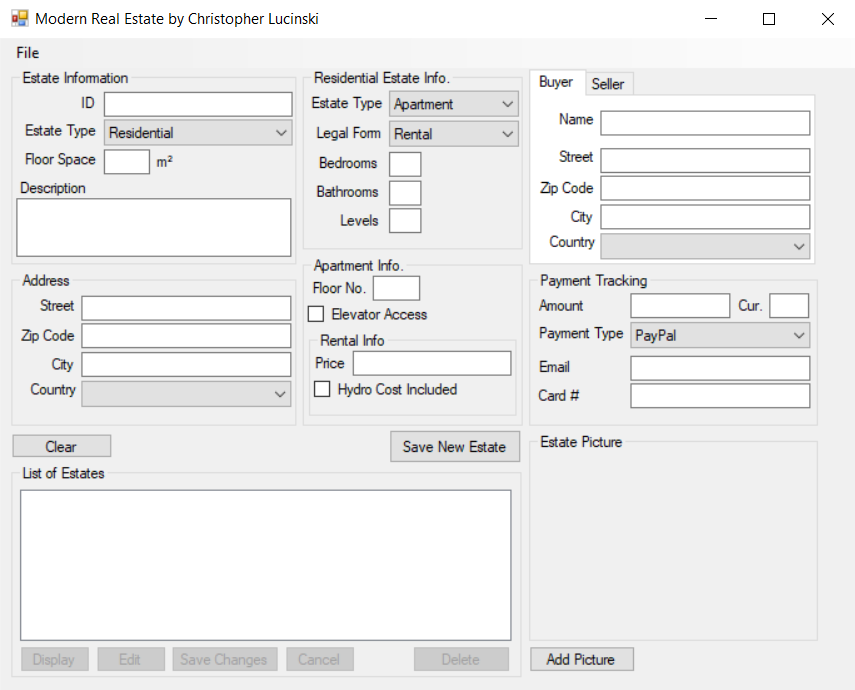
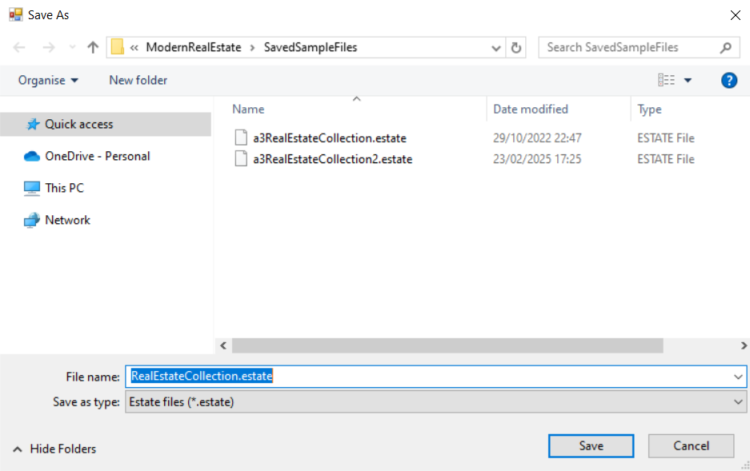

# Modern Real Estate Management System  

## Overview  
This project is a C# Windows Forms application designed for managing real estate properties. It was developed as part of a university course on object-oriented programming and software architecture. The system allows users to register various types of real estate properties, store and retrieve data using collections, and implement a structured three-layer architecture.  

The project was completed in three phases, each building upon the previous one to enhance functionality and structure. Below is a summary of the key features and technologies used in each phase.  

## Features  

### **Assignment 1 - Object-Oriented Foundation**  
- Implemented **encapsulation, inheritance, and polymorphism** using C# **OOP** principles.  
- Designed a **class hierarchy** for different real estate categories:  
  - **Residential** (Villa, Apartment, Townhouse)  
  - **Commercial** (Shops, Warehouse)  
  - **Institutional** (Hospitals, Schools, Universities)  
- Used **interfaces and abstract classes** to enforce consistency across property types.  
- Developed a **Windows Forms GUI** to add, edit, and delete real estate objects.  
- Allowed **image uploads** for properties.  

### **Assignment 2 - Collections and Data Persistence**  
- Extended the application to handle **multiple real estate objects** using a **generic list-based collection** (`List<T>`).  
- Implemented an **Estate Manager class** for managing property records.  
- Added **data validation** to ensure safe operations on the collection.  
- Introduced **serialization** (binary format) to save and load real estate data from files.  
- Enhanced the GUI with a **ListBox** to display stored properties.  

### **Assignment 3 - Three-Layer Architecture**  
- Refactored the application to follow a **three-layer architecture**:  
  - **Presentation Layer (PL):** Handles user interactions (Windows Forms GUI).  
  - **Business Logic Layer (BLL):** Contains application logic and property management operations.  
  - **Data Access Layer (DAL):** Manages data persistence and serialization.  
- Applied **exception handling** to improve application stability.  
- Ensured **modular design** by separating concerns into different assemblies **(DLLs)**.  

## Technologies Used  
- **C# (.NET Framework)**
- **Windows Forms (WinForms)**
- **Object-Oriented Programming (OOP)**
- **Generics & Collections**
- **Serialization (Binary Format)**
- **Three-Layer Architecture**
- **Visual Studio 2022+**  

## How to Run  
1. Clone the repository:  
   ```sh
   git clone https://github.com/yourusername/real-estate-manager.git
   cd real-estate-manager
   ```
2. Open the solution in **Visual Studio 2022 or later**.  
3. Build the project to generate the necessary DLLs.  
4. Run the application from the `ModernRealEstateApp` project (Presentation Layer).  
5. Using the Application:
   - Add, modify, or delete real estate objects.
    - Save and load data using the File menu.

## Screenshots  

Here are some screenshots demonstrating the application's features.  

### 🏠 Main Menu  
The main menu screen where users can navigate through different options.  
  

### 📋 Displaying a Property  
A detailed view of a selected property, including relevant information.  
  

### ✏️ Editing a Property  
Users can modify existing property details through this interface.  
  

### 📂 Additional Menus  
Various menu options available for interacting with the system.  
  

### 💾 Saving Property Data  
Demonstrating the functionality for saving property records to a file.  
  

## Future Improvements  
- Implementing an **SQL database** for persistent storage.  
- Adding **search and filtering** features for properties.  
- Enhancing the UI with **WPF** for a modern interface.  
